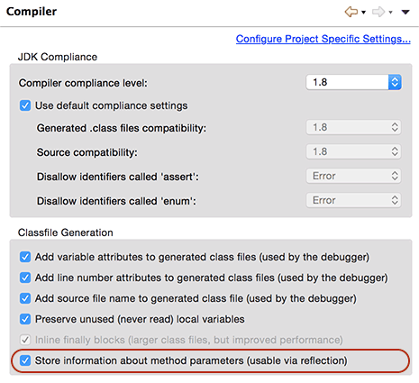

### User Guide

<div class="uk-alert uk-alert-danger">IMPORTANT: require JDK 1.8 or higher, and correct configuration of compiler.</div>

jxrest requires JDK 1.8 or higher, and your project MUST be compiled by JDK 1.8 or higher.

You MUST also set compiler options:

If you use `javac` or Ant to compile your source code, make sure add `-parameters` to `javac`.

If you use Maven to compile your source code, add following configurations to your `pom.xml`:

```
<?xml version="1.0" encoding="UTF-8"?>
<project xmlns="http://maven.apache.org/POM/4.0.0" xmlns:xsi="http://www.w3.org/2001/XMLSchema-instance"
    xsi:schemaLocation="http://maven.apache.org/POM/4.0.0 http://maven.apache.org/xsd/maven-4.0.0.xsd">
    <modelVersion>4.0.0</modelVersion>

    ...

    <build>
        <plugins>
            <plugin>
                <groupId>org.apache.maven.plugins</groupId>
                <artifactId>maven-compiler-plugin</artifactId>
                <version>3.2</version>
                <configuration>
                    <source>1.8</source>
                    <target>1.8</target>
                    <compilerArgument>-parameters</compilerArgument>
                </configuration>
            </plugin>

            ... other plugins

        </plugins> 
    </build>
</project>
```

If you use Eclipse to compile your source code, make sure enable the option in Eclipse preferences:



Make sure the option `Store information about method parameters (usable via reflection)` is checked.

### Handle REST API

jxrest only require a class that contains several methods to handle REST API.

Suppose you have a `UserHandler` that handles user of query, creation, updating and deleting:

```
public class UserHandler {

    long nextId = 0;
    Map<Long, User> users = new ConcurrentHashMap<Long, User>();

    long nextId() {
        nextId ++;
        return nextId;
    }

    @GET
    @Path("/users")
    Object getUsers() {
        return users.values().toArray(new User[0]);
    }

    @GET
    @Path("/users/:id")
    public User getUser(long id) {
        return users.get(id);
    }

    @PUT
    @Path("/users")
    User createUser(User user) {
        user.id = nextId();
        users.put(user.id, user);
        return user;
    }

    @POST
    @Path("/users/:id")
    public User updateUser(long id, User user) {
        User exist = users.get(id);
        if (exist == null) {
            throw new ApiException("entity:notfound", "User");
        }
        exist.name = user.name;
        exist.email = user.email;
        exist.password = user.password;
        return exist;
    }

    @DELETE
    @Path("/users/:id")
    private boolean deleteUser(long id) {
        User exist = users.remove(id);
        return exist != null;
    }
}
```

And you want to use URL `/api/*` to handle all REST APIs. Here is an example of `web.xml`:

```
<?xml version="1.0"?>
<web-app xmlns:xsi="http://www.w3.org/2001/XMLSchema-instance"
         xmlns="http://java.sun.com/xml/ns/javaee"
         xmlns:web="http://java.sun.com/xml/ns/javaee/web-app_3_0.xsd"
         xsi:schemaLocation="http://java.sun.com/xml/ns/javaee
                             http://java.sun.com/xml/ns/javaee/web-app_3_0.xsd"
         id="SampleWebAppID"
         version="3.0">
    <servlet>
        <servlet-name>restApiServlet</servlet-name>
        <servlet-class>com.itranswarp.jxrest.RestApiServlet</servlet-class>
        <init-param>
            <param-name>handlers</param-name>
            <param-value>your.UserHandler</param-value>
        </init-param>
        <init-param>
            <param-name>urlPrefix</param-name>
            <param-value>/api</param-value>
        </init-param>
        <load-on-startup>0</load-on-startup>
    </servlet>

    <servlet-mapping>
        <servlet-name>restApiServlet</servlet-name>
        <url-pattern>/api/*</url-pattern>
    </servlet-mapping>
</web-app>
```

The built-in `com.itranswarp.jxrest.RestApiServlet` will handle all API request of `/api/*`. 
Note that the `restApiServlet` has a configuration of `urlPrefix` with value `/api`, so a request 
from client `POST http://localhost/api/users/123` will first match the servlet mapping `/api`, 
and restApiServlet will remove the prefix `/api` and use the left `/users/123` to match the 
`@Path` which defined by method `updateUser()`. So finally the `updateUser()` is invoked, and its 
return value will be serialized as JSON response.

You can define as many handlers as you wish, each handler is seperated by `,`:

```
<init-param>
    <param-name>handlers</param-name>
    <param-value>your.UserHandler, your.BookHandler, your.other.handlers</param-value>
</init-param>
```

Package name is also accepted and jxrest will scan the package to find all handlers automatically, 
but sub-packages are not included.

### Use Path Variables

Path variables are defined by pattern `:varName`, and jxrest tries to find the method variable with 
the same name when invoke the method:

```
@GET
@Path("/path/to/:groupId/:userId")
Object find(String groupId, int userId) {
    ...
}
```

Path varable name cannot have `_`, for it is a limitation of group name in regular express.

Primitive type (e.g. int) and its wrapper class (e.g. Integer) are allowed.

### JSON Object

The method which handles a REST API can have one argument to accept a JSON object:

```
@POST
@Path("/path/to/post/:id")
Object update(int id, User user) {
    ...
}
```

jxrest tries to convert JSON to your defined type. You can use any standard JavaBean, or `Map<String, Object>`.

NOTE: method with `@GET` cannot accept the JSON object.

### Use Queries

It is convenient if the method can get query strings directly instead of calling `HttpServletRequest.getParameter()`. 
jxrest allows you define an argument with type `Map<String, String>` and name `query`:

```
@GET
@Path("/path/get/:groupId")
Object findUsers(String groupId, Map<String, String> query) {
    ...
}
```

### Use HttpServletRequest and HttpServletResponse

If you want to access the HttpServletRequest and HttpServletResponse object, you can add arguments to 
your method, just make sure the argument type is correct:

```
@GET
@Path("/path/get/:groupId")
Object findUsers(String groupId, HttpServletRequest req, HttpServletResponse resp) {
    ...
}
```

### Order of Arguments

jxrest can recognize your method and its arguments, but there is no order of the arguments required. 
The following definition is OK:

```
@GET
@Path("/path/get/:groupId")
Object findUsers(HttpServletResponse resp, Map<String, String> query, String groupId, HttpServletRequest req) {
    ...
}
```

### Benifit

Using jxrest as JSON-based API framework is really great. Now you can concentrate on your business logic, and 
you can test your business logic much easier. Your handler is just normal class. It is not depends on jxrest, it only 
references a few annotations.

Cool!
